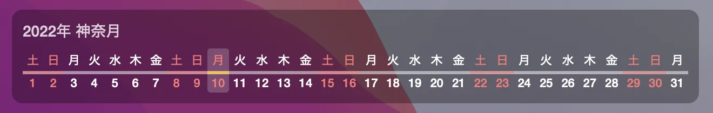

# horizontal-calendar-widget

A simple Japaneseized [Übersicht](http://tracesof.net/uebersicht/) Widget. This will enable a sleek Dateline-like horizontal calendar on your desktop to make it more useful.

## Screenshot

## Third Party Libraries
This widget incorporates and uses the following libraries.

 - [japanese-holidays-js](https://github.com/osamutake/japanese-holidays-js)

## License
 - [CC0 1.0 Universal](./LICENSE)
